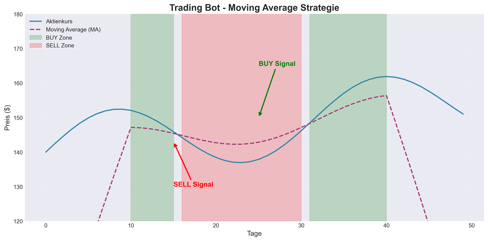

# Trading Bots

Dieses Verzeichnis enthält verschiedene Trading-Bot-Projekte und Trading-bezogene Experimente.

## Projekte

### 1. Simple Trading Bot (`Training/Simple_Traiding_Bot.py`)

Ein einfacher Trading-Bot, der auf **Moving Average (MA)** Strategie basiert.

#### Was macht dieser Bot?

Der Bot analysiert den aktuellen Aktienkurs im Verhältnis zum Moving Average und gibt Trading-Signale aus:

- **KAUFEN**: Wenn der Preis über dem MA liegt und die Differenz innerhalb der Risikotoleranz ist
- **VERKAUFEN**: Wenn der Preis unter dem MA liegt
- **HALTEN**: Wenn der Preis zu stark gestiegen ist oder gleich dem MA ist

#### Konzepte die du hier lernst:

1. **Moving Average (MA)**: Ein technischer Indikator, der den Durchschnittspreis über einen bestimmten Zeitraum darstellt
2. **Risikomanagement**: Verwendung von Risikotoleranz um zu große Preisbewegungen zu vermeiden
3. **If-Else Logik**: Verschachtelte Bedingungen für komplexe Entscheidungen
4. **Prozentuale Berechnungen**: Berechnung der Preisdifferenz in Prozent

#### Wie funktioniert die Strategie?

```
Aktienkurs = 155€
Moving Average = 145€
Risikotoleranz = 5% (0.05)

Preisdifferenz = (155 - 145) / 145 = 0.069 = 6.9%

Da 6.9% > 5% → Der Preis ist zu stark gestiegen → HALTEN
```



**Legende:**
- 🔵 Blaue Linie: Aktienkurs
- 🟣 Lila gestrichelte Linie: Moving Average
- 🟢 Grüne Zone: BUY Signal (Preis über MA, innerhalb Risikotoleranz)
- 🔴 Rote Zone: SELL Signal (Preis unter MA)

#### Nächste Schritte:

- [ ] Echte Marktdaten von einer API abrufen (z.B. yfinance)
- [ ] Moving Average automatisch berechnen statt manuell eingeben
- [ ] Mehrere Indikatoren kombinieren (RSI, MACD)
- [ ] Backtesting: Strategie mit historischen Daten testen
- [ ] Paper Trading: Mit Simulation testen

#### Für Arbeitgeber:

Dieses Projekt zeigt:
- Verständnis von Trading-Strategien und technischen Indikatoren
- Logisches Denken und Entscheidungsstrukturen in Code
- Risikomanagement-Konzepte
- Grundlage für komplexere algorithmische Trading-Systeme

---

### 2. Trading Journal (`Traiding_Journal.ipynb`)

Ein Jupyter Notebook zur Dokumentation und Analyse von Trading-Entscheidungen.

#### Verwendung:

```bash
jupyter notebook trading-bots/Traiding_Journal.ipynb
```

---

## Installation & Verwendung

### Voraussetzungen:

```bash
# Virtual Environment aktivieren
source .venv/bin/activate

# Benötigte Pakete (für zukünftige Erweiterungen)
pip install pandas numpy matplotlib yfinance
```

### Simple Trading Bot ausführen:

```bash
python trading-bots/Training/Simple_Traiding_Bot.py
```

### Eigene Werte testen:

Öffne die Datei und ändere die Variablen:

```python
Aktienkurs = 160        # Aktueller Preis
MA = 145                # Moving Average
Risikotoleranz = 0.05   # 5% Risikotoleranz
```

## Learning Resources

### Empfohlene Lernthemen:

1. **Technische Analyse**: Moving Averages, RSI, MACD, Bollinger Bands
2. **Python für Finance**: pandas, numpy, yfinance Libraries
3. **Backtesting**: Strategien mit historischen Daten testen
4. **Risk Management**: Position Sizing, Stop Loss, Take Profit
5. **APIs**: Integration mit Börsen-APIs (Binance, Coinbase, etc.)

### Nützliche Links:

- [Investopedia - Moving Average](https://www.investopedia.com/terms/m/movingaverage.asp)
- [Python for Finance](https://www.datacamp.com/courses/introduction-to-python-for-finance)
- [Algorithmic Trading](https://www.quantstart.com/articles/Algorithmic-Trading-Strategy-Python/)